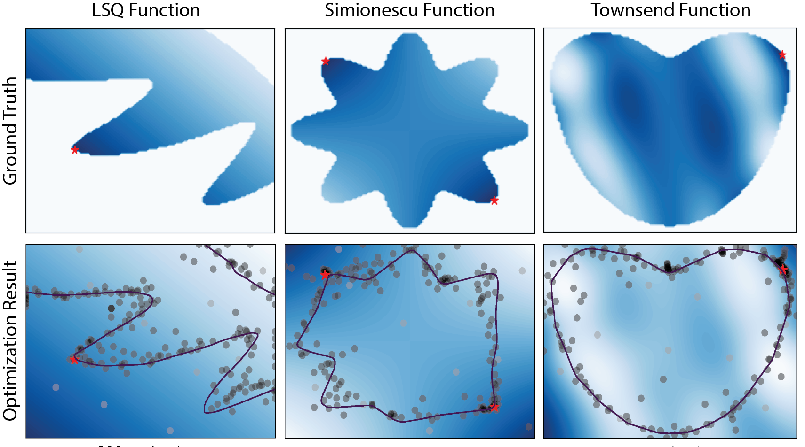

# BE-CBO

This repository contains the official implementation of [Boundary Exploration for Bayesian Optimization With Unknown Physical Constraints (ICML 2024)](https://arxiv.org/pdf/2402.07692.pdf).



**Authors**: Yunsheng Tian, Ane Zuniga, Xinwei Zhang, Johannes P. Dürholt, Payel Das, Jie Chen, Wojciech Matusik, Mina Konaković Luković

**Summary**: Bayesian optimization has been successfully applied to optimize black-box functions where the number of evaluations is severely limited. However, in many real-world applications, it is hard or impossible to know in advance which designs are feasible due to some physical or system limitations. These issues lead to an even more challenging problem of optimizing an unknown function with unknown constraints. In this paper, we observe that in such scenarios optimal solution typically lies on the boundary between feasible and infeasible regions of the design space, making it considerably more difficult than that with interior optima. Inspired by this observation, we propose BE-CBO, a new Bayesian optimization method that efficiently explores the boundary between feasible and infeasible designs. To identify the boundary, we learn the constraints with an ensemble of neural networks that outperform the standard Gaussian Processes for capturing complex boundaries. Our method demonstrates superior performance against state-of-the-art methods through comprehensive experiments on synthetic and real-world benchmarks.

## Installation

Clone this repository and install the following Python packages:

```
pip install numpy torch gpytorch==1.7.0 botorch==0.6.5
```

It is important to ensure versions of the dependency packages are correct to prevent API mismatches. Tested with Python 3.7/3.8 under MacOS/Ubuntu.

## Getting Started

### Run single experiment

The following command runs a single experiment with a given function and algorithm.

```
python exp/run_exp.py --fun FUN_NAME --algo ALGO_NAME --reg-type REGRESSOR --cls-type CLASSIFIER --log-path LOG_PATH
```

See `algorithms/__init__.py` for the list of algorithms supported and `test_functions/__init__.py` for the list of test functions supported. For regressor, we support `gp` only. For classifier, we support `gp` and `de`. For specifying more detailed experiment setups, see more arguments in `exp/test.py`.

To also save surrogate predictions (objective, constraint, acquisition landscape) of every iteration, run the following command. Note that the log takes much more storage with predictions saved.

```
python exp/run_exp_with_prediction.py --fun FUN_NAME --algo ALGO_NAME --reg-type REGRESSOR --cls-type CLASSIFIER --log-path LOG_PATH
```

### Run parallel experiments

The following command runs multiple experiments in parallel with a given list of functions and algorithms (combinations) with multiple seeds.

```
python exp/run_exp_parallel.py --fun FUN_NAME1 FUN_NAME2 ... --algo ALGO_NAME1 ALGO_NAME2 ... --reg-type REGRESSOR1 REGRESSOR2 ... --cls-type CLASSIFIER1 CLASSIFIER2 ... --n-seed N_SEED --log-dir LOG_DIR --num-proc NUM_PROC
```

### Plot single experiment results

Plotting log from a single experiment (run_exp.py):

```
python plot/plot_progress.py --log-path LOG_PATH --save-path SAVE_PATH
```

Plotting multiple logs together is also supported:

```
python plot/plot_progress.py --log-path LOG_PATH1 LOG_PATH2 ... --save-path SAVE_PATH
```

### Plot parallel experiment results

Plotting logs from parallel experiments (run_exp_parallel.py):

```
python plot/plot_progress_by_exp_batch.py --log-dir LOG_DIR --save-dir SAVE_DIR --fun FUN_NAME1 FUN_NAME2 ... --algo ALGO_NAME1 ALGO_NAME2 ... --model-type REGRESSOR1_CLASSIFIER1 REGRESSOR2_CLASSIFIER2 ...
```

### Plot animations

The following command plots the animation of a single experiment run. `--prediction` argument can be added if the prediction is also saved.

```
python plot/plot_animation.py --log-path LOG_PATH --save-path SAVE_PATH
```

The following command plots the animations of batch experiments. `--prediction` argument can be added similarly if applicable.

```
python plot/plot_animation_batch.py --log-dir LOG_DIR --save-dir SAVE_DIR --num-proc NUM_PROC --n-seed N_SEED
```

## Contact

Please feel free to contact yunsheng@csail.mit.edu or create a GitHub issue for any questions.

## Citation

If you find our implementation of the algorithms and benchmark functions useful, please consider citing:

```
@misc{tian2024boundary,
      title={Boundary Exploration for Bayesian Optimization With Unknown Physical Constraints}, 
      author={Yunsheng Tian and Ane Zuniga and Xinwei Zhang and Johannes P. Dürholt and Payel Das and Jie Chen and Wojciech Matusik and Mina Konaković Luković},
      year={2024},
      eprint={2402.07692},
      archivePrefix={arXiv},
      primaryClass={cs.LG}
}
```
